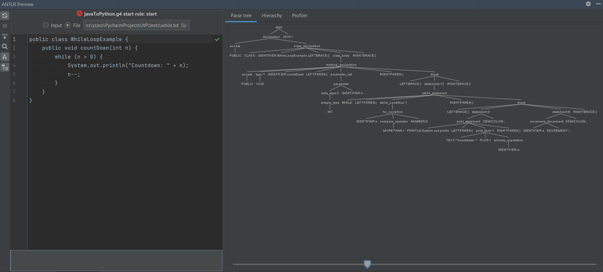
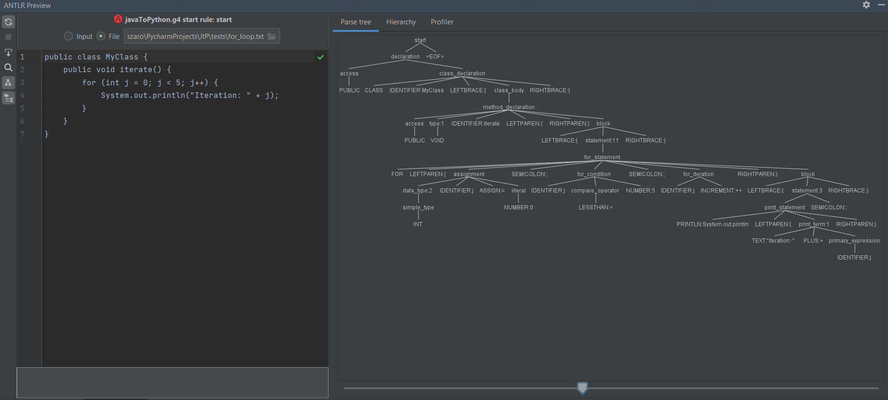

# Java to Python Converter
This project is a Java to Python converter implemented using ANTLR. It defines a grammar to parse Java source code and translates it into equivalent Python code. The conversion is done by a visitor pattern implemented in the JavaToPythonConverter class.
## Features
- Parses Java source code using a defined ANTLR grammar.
- Converts Java constructs such as classes, methods, fields, and statements into Python equivalents.
- Supports comments and various Java language features like enums, interfaces, loops, and conditionals.
- Handles imports and translates them to Python import statements.
## Getting started 
### Prerequisites
- Python 3.6 or higher
- ANTLR 4.8 or higher
- Java (for running ANTLR)
### Installation
1) Clone the repository:
````
git clone https://github.com/your-username/java-to-python-converter.git
cd java-to-python-converter
````
2) Install the required Python packages:
````
pip install antlr4-python3-runtime
````
3) Generate the lexer and parser using ANTLR:
````
antlr4 -Dlanguage=Python3 javaToPython.g4
````
## Usage
1) Create a Python script to use the converter:
````
import os
from antlr4 import *
from javaToPythonLexer import javaToPythonLexer
from javaToPythonParser import javaToPythonParser
from javaToPythonVisitor import JavaToPythonConverter

def main():
    input_file = "example.java"
    input_stream = FileStream(input_file)
    lexer = javaToPythonLexer(input_stream)
    stream = CommonTokenStream(lexer)
    parser = javaToPythonParser(stream)
    tree = parser.start()

    converter = JavaToPythonConverter()
    converter.visit(tree)
    
    with open("output.py", "w") as output_file:
        output_file.write(converter.output)

if __name__ == "__main__":
    main()
````
2) Place your Java source file (e.g., example.java) in the same directory and run the script:
````
python convert.py
````
3) The converted Python code will be written to output.py.
## Example
**Java Code (example.java)**
````
public class Example {
    public static void main(String[] args) {
        System.out.println("Hello, World!");
    }
}
````
**Converted Python Code (output.py)**
````
class Example:
    def main(args):
        print("Hello, World!")
````
## Project Structure
- **javaToPython.g4**: The ANTLR grammar file defining the Java language syntax.
- **javaToPythonLexer.py**, **javaToPythonParser.py**, **javaToPythonVisitor.py**: Generated by ANTLR from the grammar file.
- **convert.py**: Example script to run the converter.
- **README.md**: Project documentation.
## ANTLR Parse Tree
Here's an example of an ANTLR parse tree generated from a Java file:


## Acknowledgements
- ANTLR for providing a powerful parser generator.
- Python for being the target language of this project.
  
